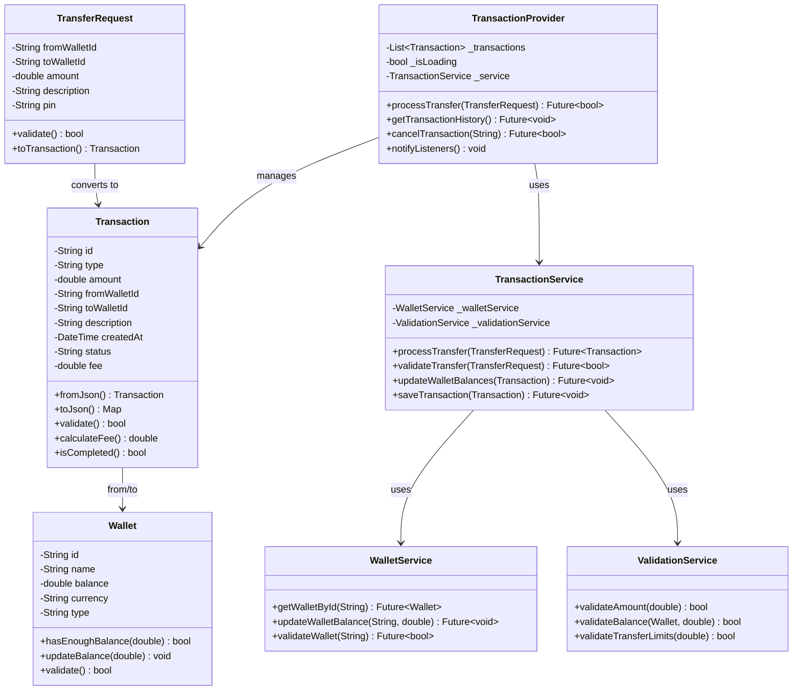

# Sơ đồ Lớp - Chức năng Chuyển tiền và Giao dịch

## 1. Sơ đồ Lớp Tổng Quan



## 2. Sơ đồ Lớp Chi Tiết

```
┌─────────────────────────────────────────────────────────────────────────────┐
│                           TRANSACTION MODEL                                 │
├─────────────────────────────────────────────────────────────────────────────┤
│ Transaction                                                                 │
├─────────────────────────────────────────────────────────────────────────────┤
│ - id: String                                                               │
│ - type: String (transfer, deposit, withdrawal)                             │
│ - amount: double                                                           │
│ - fromWalletId: String                                                     │
│ - toWalletId: String?                                                      │
│ - description: String                                                      │
│ - createdAt: DateTime                                                      │
│ - status: String (pending, completed, failed, cancelled)                  │
│ - fee: double?                                                             │
│ - reference: String?                                                       │
├─────────────────────────────────────────────────────────────────────────────┤
│ + Transaction({required params})                                           │
│ + fromJson(Map<String, dynamic>) : Transaction                            │
│ + toJson() : Map<String, dynamic>                                         │
│ + copyWith({params}) : Transaction                                        │
│ + validate() : bool                                                       │
│ + calculateFee() : double                                                 │
│ + isCompleted() : bool                                                    │
│ + canCancel() : bool                                                      │
│ + getDisplayAmount() : String                                             │
│ + toString() : String                                                     │
└─────────────────────────────────────────────────────────────────────────────┘
                                    │
                                    │ uses
                                    ▼
┌─────────────────────────────────────────────────────────────────────────────┐
│                            WALLET MODEL                                     │
├─────────────────────────────────────────────────────────────────────────────┤
│ Wallet                                                                      │
├─────────────────────────────────────────────────────────────────────────────┤
│ - id: String                                                               │
│ - name: String                                                             │
│ - type: String                                                             │
│ - balance: double                                                          │
│ - currency: String                                                         │
│ - bankName: String?                                                        │
│ - accountNumber: String?                                                   │
│ - isDefault: bool                                                          │
│ - color: String                                                            │
│ - icon: String                                                             │
├─────────────────────────────────────────────────────────────────────────────┤
│ + Wallet({required params})                                               │
│ + fromJson(Map<String, dynamic>) : Wallet                                │
│ + toJson() : Map<String, dynamic>                                         │
│ + hasEnoughBalance(double amount) : bool                                  │
│ + updateBalance(double amount) : void                                     │
│ + validate() : bool                                                       │
│ + getFormattedBalance() : String                                          │
└─────────────────────────────────────────────────────────────────────────────┘
```

## 3. Sơ đồ Lớp Services

```
┌─────────────────────────────────────────────────────────────────────────────┐
│                        TRANSACTION SERVICE                                  │
├─────────────────────────────────────────────────────────────────────────────┤
│ TransactionService                                                          │
├─────────────────────────────────────────────────────────────────────────────┤
│ - _walletService: WalletService                                            │
│ - _validationService: ValidationService                                    │
│ - _securityService: SecurityService                                        │
│ - _database: DatabaseHelper                                                │
├─────────────────────────────────────────────────────────────────────────────┤
│ + processTransfer(TransferRequest) : Future<Transaction>                   │
│ + validateTransfer(TransferRequest) : Future<bool>                         │
│ + getTransactionHistory(String walletId) : Future<List<Transaction>>       │
│ + getTransactionById(String id) : Future<Transaction?>                     │
│ + cancelTransaction(String id) : Future<bool>                              │
│ + retryTransaction(String id) : Future<Transaction>                        │
│ + updateWalletBalances(Transaction) : Future<void>                         │
│ + saveTransaction(Transaction) : Future<void>                              │
│ + calculateTransactionFee(double amount) : double                          │
│ - _executeTransfer(Transaction) : Future<void>                             │
│ - _rollbackTransfer(Transaction) : Future<void>                            │
└─────────────────────────────────────────────────────────────────────────────┘
                                    │
                                    │ uses
                                    ▼
┌─────────────────────────────────────────────────────────────────────────────┐
│                         WALLET SERVICE                                      │
├─────────────────────────────────────────────────────────────────────────────┤
│ WalletService                                                               │
├─────────────────────────────────────────────────────────────────────────────┤
│ - _database: DatabaseHelper                                                │
│ - _cache: Map<String, Wallet>                                              │
├─────────────────────────────────────────────────────────────────────────────┤
│ + getAllWallets() : Future<List<Wallet>>                                   │
│ + getWalletById(String id) : Future<Wallet?>                               │
│ + updateWalletBalance(String id, double amount) : Future<void>             │
│ + validateWallet(String id) : Future<bool>                                 │
│ + lockWallet(String id) : Future<void>                                     │
│ + unlockWallet(String id) : Future<void>                                   │
│ + getWalletBalance(String id) : Future<double>                             │
│ + isWalletActive(String id) : Future<bool>                                 │
└─────────────────────────────────────────────────────────────────────────────┘
                                    │
                                    │ uses
                                    ▼
┌─────────────────────────────────────────────────────────────────────────────┐
│                       VALIDATION SERVICE                                    │
├─────────────────────────────────────────────────────────────────────────────┤
│ ValidationService                                                           │
├─────────────────────────────────────────────────────────────────────────────┤
│ + validateAmount(double amount) : bool                                     │
│ + validateWalletId(String id) : bool                                       │
│ + validatePin(String pin) : bool                                           │
│ + validateBalance(Wallet wallet, double amount) : bool                     │
│ + validateTransferLimits(double amount) : bool                             │
│ + checkDailyLimit(String walletId, double amount) : Future<bool>           │
│ + validateTransferRequest(TransferRequest) : ValidationResult              │
└─────────────────────────────────────────────────────────────────────────────┘
```