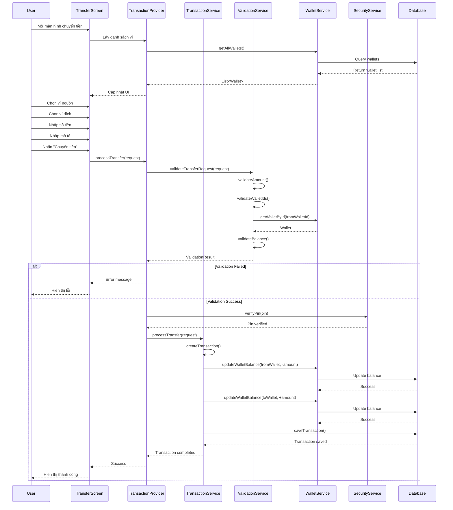

# Sơ đồ Trình Tự - Chức năng Chuyển tiền và Giao dịch

## 1. Sơ đồ Sequence - Quy trình Chuyển tiền Hoàn chỉnh



## 2. Sơ đồ Sequence Chi Tiết - Xác thực và Bảo mật

```
User    TransferScreen  TransactionProvider  SecurityService  ValidationService  WalletService  Database
 │           │                │                 │                │               │            │
 │──input────►│                │                 │                │               │            │
 │ transfer   │                │                 │                │               │            │
 │ details    │                │                 │                │               │            │
 │           │──validate──────►│                 │                │               │            │
 │           │  input()        │                 │                │               │            │
 │           │                │──validate───────►│                │               │            │
 │           │                │  request()       │                │               │            │
 │           │                │                 │──check─────────►│               │            │
 │           │                │                 │  amount()      │               │            │
 │           │                │                 │               │──get──────────►│            │
 │           │                │                 │               │  wallet()     │            │
 │           │                │                 │               │               │──query────►│
 │           │                │                 │               │               │           │
 │           │                │                 │               │               │◄─result───│
 │           │                │                 │               │◄─wallet───────│            │
 │           │                │                 │◄─valid/───────│               │            │
 │           │                │                 │  error        │               │            │
 │           │                │◄─result()───────│                │               │            │
 │           │                │                 │                │               │            │
 │           │──request───────►│                 │                │               │            │
 │           │  pin()          │                 │                │               │            │
 │           │                │──verify─────────►│                │               │            │
 │           │                │  pin()          │                │               │            │
 │           │                │                 │──hash──────────►│               │            │
 │           │                │                 │  pin()         │               │            │
 │           │                │                 │◄─hashed────────│               │            │
 │           │                │                 │  pin           │               │            │
 │           │                │◄─verified/──────│                │               │            │
 │           │                │  failed         │                │               │            │
 │           │◄─result()───────│                 │                │               │            │
 │◄─success/─│                │                 │                │               │            │
 │  error    │                │                 │                │               │            │
```

## 3. Sơ đồ Sequence - Xử lý Giao dịch và Cập nhật Số dư

```
TransactionService  WalletService  Database  NotificationService  AuditService
        │               │           │              │                │
        │──begin────────►│           │              │                │
        │  transaction() │           │              │                │
        │               │──lock─────►│              │                │
        │               │  wallets() │              │                │
        │               │           │──lock────────►│                │
        │               │           │  records     │                │
        │               │           │◄─locked──────│                │
        │               │◄─locked───│              │                │
        │               │           │              │                │
        │──update───────►│           │              │                │
        │  from_wallet() │           │              │                │
        │               │──update───►│              │                │
        │               │  balance() │              │                │
        │               │           │──execute─────►│                │
        │               │           │  update      │                │
        │               │           │◄─success─────│                │
        │               │◄─updated──│              │                │
        │               │           │              │                │
        │──update───────►│           │              │                │
        │  to_wallet()   │           │              │                │
        │               │──update───►│              │                │
        │               │  balance() │              │                │
        │               │           │──execute─────►│                │
        │               │           │  update      │                │
        │               │           │◄─success─────│                │
        │               │◄─updated──│              │                │
        │               │           │              │                │
        │──save─────────►│           │              │                │
        │  transaction() │           │              │                │
        │               │──insert───►│              │                │
        │               │  record()  │              │                │
        │               │           │──execute─────►│                │
        │               │           │  insert      │                │
        │               │           │◄─success─────│                │
        │               │◄─saved────│              │                │
        │               │           │              │                │
        │──commit───────►│           │              │                │
        │  transaction() │           │              │                │
        │               │──unlock───►│              │                │
        │               │  wallets() │              │                │
        │               │           │──commit──────►│                │
        │               │           │              │                │
        │               │           │◄─committed───│                │
        │               │◄─unlocked─│              │                │
        │               │           │              │                │
        │──notify───────────────────────────────────►│                │
        │  success()                               │                │
        │                                         │──send────────────►│
        │                                         │  notification()  │
        │──log──────────────────────────────────────────────────────►│
        │  transaction()                                             │
        │                                                           │──audit──►│
        │                                                           │  log()   │
```

## 4. Sơ đồ Sequence - Xử lý Lỗi và Rollback

```
TransactionService  WalletService  Database  ErrorHandler  NotificationService
        │               │           │           │               │
        │──process──────►│           │           │               │
        │  transfer()    │           │           │               │
        │               │──update───►│           │               │
        │               │  balance() │           │               │
        │               │           │──execute──►│               │
        │               │           │           │               │
        │               │           │◄─error────│               │
        │               │◄─failed───│           │               │
        │◄─error────────│           │           │               │
        │               │           │           │               │
        │──handle───────────────────────────────►│               │
        │  error()                              │               │
        │                                       │──log──────────►│
        │                                       │  error()      │
        │                                       │               │
        │──rollback─────►│           │           │               │
        │  changes()     │           │           │               │
        │               │──restore──►│           │               │
        │               │  balance() │           │               │
        │               │           │──rollback─►│               │
        │               │           │           │               │
        │               │           │◄─restored─│               │
        │               │◄─restored─│           │               │
        │◄─rollback─────│           │           │               │
        │  complete     │           │           │               │
        │               │           │           │               │
        │──notify───────────────────────────────────────────────►│
        │  failure()                                           │
        │                                                     │──send──►│
        │                                                     │ alert() │
```

## 5. Sơ đồ Activity - Quy trình Chuyển tiền

```
    ┌─────────────┐
    │   Bắt đầu   │
    └──────┬──────┘
           │
    ┌──────▼──────┐
    │ Chọn ví     │
    │ nguồn       │
    └──────┬──────┘
           │
    ┌──────▼──────┐
    │ Chọn ví đích│
    └──────┬──────┘
           │
    ┌──────▼──────┐
    │ Nhập số tiền│
    └──────┬──────┘
           │
    ┌──────▼──────┐
    │ Kiểm tra    │◄─────┐
    │ số dư       │      │
    └──────┬──────┘      │
           │              │
    ┌──────▼──────┐      │
    │ Số dư đủ?   │      │
    └──────┬──────┘      │
           │              │
          Yes             │
           │              │
    ┌──────▼──────┐      │
    │ Nhập PIN    │      │
    └──────┬──────┘      │
           │              │
    ┌──────▼──────┐      │
    │ Xác thực PIN│      │
    └──────┬──────┘      │
           │              │
    ┌──────▼──────┐      │
    │ PIN đúng?   │      │
    └──────┬──────┘      │
           │              │
          Yes             │
           │              │
    ┌──────▼──────┐      │
    │ Thực hiện   │      │
    │ chuyển tiền │      │
    └──────┬──────┘      │
           │              │
    ┌──────▼──────┐      │
    │ Cập nhật    │      │
    │ số dư       │      │
    └──────┬──────┘      │
           │              │
    ┌──────▼──────┐      │
    │ Lưu giao    │      │
    │ dịch        │      │
    └──────┬──────┘      │
           │              │
    ┌──────▼──────┐      │
    │ Thông báo   │      │
    │ thành công  │      │
    └──────┬──────┘      │
           │              │
    ┌──────▼──────┐      │
    │   Kết thúc  │      │
    └─────────────┘      │
                         │
           No            │
    ┌──────▼──────┐      │
    │ Hiển thị    │──────┘
    │ lỗi         │
    └─────────────┘
```